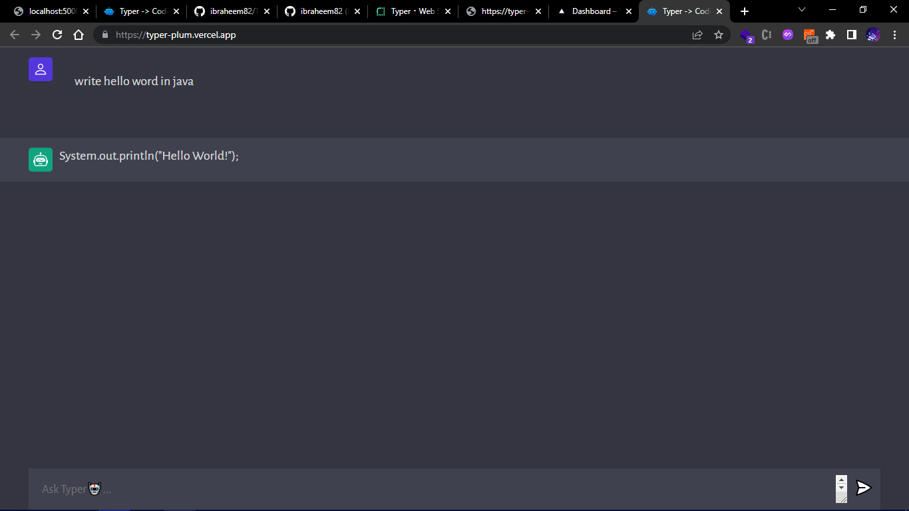

<!-- @format -->


# ChatGpt Clone

## This application can answer any question, about coding javascript and many more, you can use the application to learn coding

_Photo:_


#### In order for you to build this project.

#### Set up a VITE project, and vanila as the project template.

---

### create a a folder name server, cd in to the server and install the following packages.

```
npm i cors
npm i dotenv
npm i express
npm i nodemon
npm i openai
```

> You can go through the openai documentation for more information, on our to consume and use thier api.

## I plan to advance this project in the future by building a desktop application or probably mobile application.

_Built with ❤ by Astro🚀_
